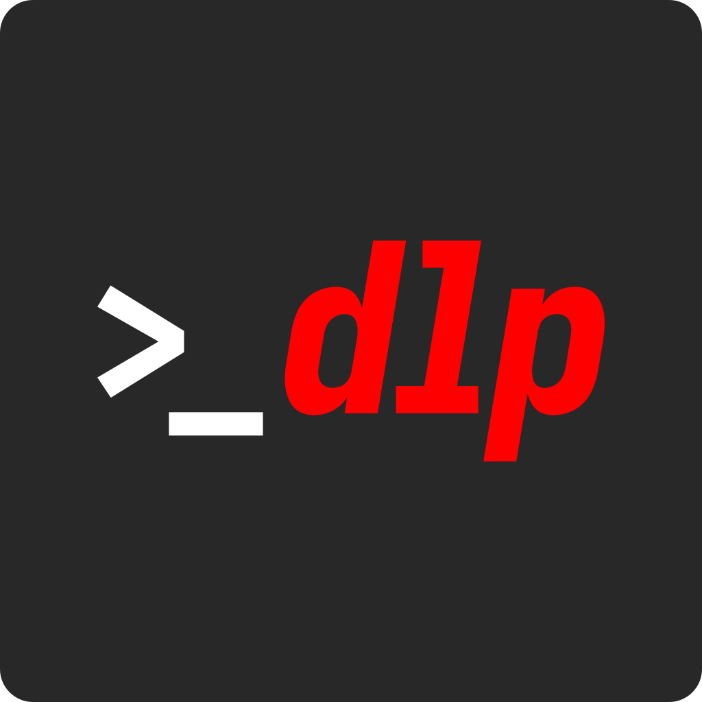
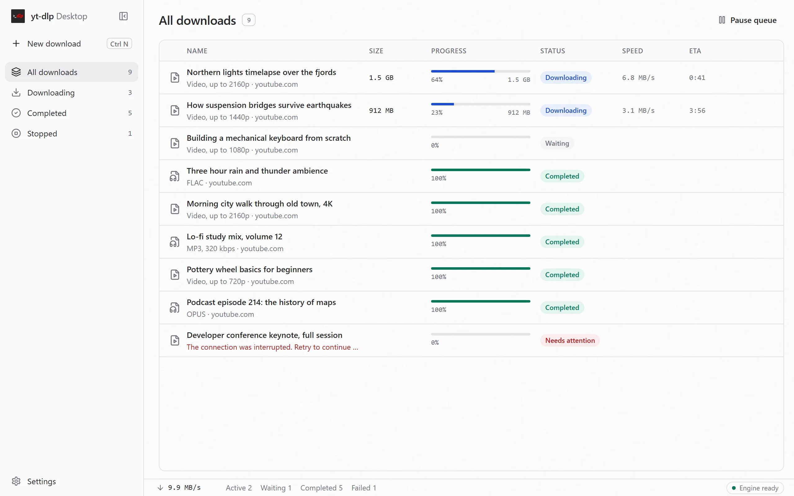
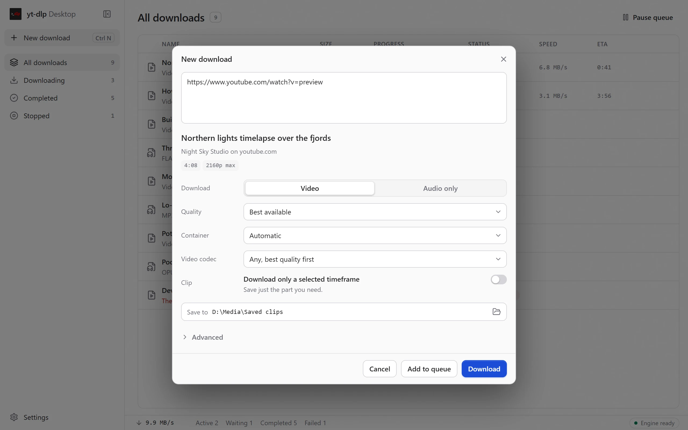

<div align="center">



# yt-dlp Desktop

[](https://github.com/NitroDiesel/yt-dlp-desktop/releases/latest)
[](https://github.com/NitroDiesel/yt-dlp-desktop/releases)
[](https://github.com/NitroDiesel/yt-dlp-desktop/issues)
[](https://github.com/NitroDiesel/yt-dlp-desktop/graphs/contributors)
[](#install)
[](LICENSE)

*Download video and audio with yt-dlp, without the command line.*

<picture>
  <source media="(prefers-color-scheme: dark)" srcset="docs/media/downloads-dark.webp">
  
</picture>

</div>

yt-dlp Desktop is a download manager built on [yt-dlp](https://github.com/yt-dlp/yt-dlp), the command-line tool behind most video downloaders. Paste a link, choose from the formats the site actually offers, and the file lands in your folder. It works with YouTube, TikTok, Instagram, X, Reddit, Twitch, Vimeo, SoundCloud, Bilibili, and the [other sites yt-dlp supports](https://github.com/yt-dlp/yt-dlp/blob/master/supportedsites.md), over a thousand of them.

> Download only media you are authorized to access. This project does not bypass DRM and is not affiliated with yt-dlp or supported media services.

## How it differs from other yt-dlp apps

There are good yt-dlp front-ends already, such as [Parabolic](https://github.com/NickvisionApps/Parabolic) and [Open Video Downloader](https://github.com/jely2002/youtube-dl-gui). yt-dlp Desktop puts its effort into these:

- **Ready on first launch.** It ships Deno, the JavaScript runtime yt-dlp now needs for YouTube, together with FFmpeg and FFprobe, so merging, audio conversion, and YouTube work without any extra setup.
- **All of yt-dlp as controls, with no argument box.** Clips by time range, SponsorBlock, chapters, subtitle conversion, playlist date windows and item ranges, dubbed audio tracks, browser impersonation, region bypass, and cookies from your browser are all buttons, switches, and lists.
- **A real download manager.** One list of every download, laid out like Motrix, with a details panel, paste-a-link-anywhere, and a queue that survives a restart. Downloads stopped by a crash or shutdown are marked so you can resume them.
- **GPU conversion that is tested, not guessed.** NVENC and AMF codecs appear only after a real test encode succeeds on your GPU and driver.
- **yt-dlp that stays current safely.** The app updates its own copy of yt-dlp through yt-dlp's updater, which checks each download against the official release checksums. The bundled build stays as a fallback.
- **Careful with your computer.** yt-dlp runs as a direct process with typed arguments and never through a shell. The app only opens or deletes files it downloaded into the folder you chose, and deleted files go to the Recycle Bin or Trash. It sends no telemetry, and cookie files are read in place, never copied.
- **Free and open source,** under the GPL, with no account, ads, or subscription. Every release publishes checksums and GitHub build provenance, so you can check that an installer came from this repository.

## Features

<picture>
  <source media="(prefers-color-scheme: dark)" srcset="docs/media/new-download-dark.webp">
  
</picture>

- Reads a video, playlist, or channel link before downloading and shows its title, length, and formats.
- Video or audio only, quality from best down to 144p, MP4, MKV, or WebM, and MP3, M4A, Opus, FLAC, or WAV at a chosen bitrate.
- Exact stream picking, codec preference, subtitles in any offered language, embedded metadata, thumbnails, and chapters.
- Downloads only part of a video, with exact cuts or a faster keyframe cut.
- Downloads list filtered by Downloading, Completed, and Stopped, with pause, reorder, retry, cancel, open, and show in folder.
- Remove a download from the list and choose whether to keep its file or move it to the Recycle Bin or Trash.
- Remembers your last folder, accent color, theme, and sidebar layout.
- Optional re-encode to H.264, HEVC, or AV1 on an NVIDIA or AMD GPU.

## Install

Download the package for your system from the [latest release](https://github.com/NitroDiesel/yt-dlp-desktop/releases/latest) and install it normally.

| System | Package |
| --- | --- |
| Windows 10 or 11, x64 | `x64-setup.exe` |
| macOS 12 or newer, Apple silicon | `aarch64.dmg` |
| macOS 12 or newer, Intel | `x64.dmg` |
| Linux x64 | `amd64.deb` for Debian and Ubuntu, `amd64.AppImage` for other distributions |

Everything needed for downloading is included. Custom tool paths in **Settings → Download engine** are optional.

## Develop

Prerequisites for contributors:

- Rust stable
- Node.js 22.13 or newer and pnpm 11
- The [Tauri 2 platform prerequisites](https://v2.tauri.app/start/prerequisites/)

```powershell
pnpm install --frozen-lockfile
./scripts/prepare-sidecars.ps1
pnpm tauri dev
```

On macOS or Linux, run `./scripts/prepare-sidecars.sh` instead. Sidecar preparation downloads immutable official release assets and refuses to continue if a SHA-256 checksum differs from `packaging/components.json`.

Useful checks:

```text
pnpm lint
pnpm test
pnpm build
cargo fmt --manifest-path src-tauri/Cargo.toml --all -- --check
cargo clippy --manifest-path src-tauri/Cargo.toml --all-targets --all-features -- -D warnings
cargo test --manifest-path src-tauri/Cargo.toml --all-targets --all-features
```

The screenshots in `docs/media` come from the development-only visual preview (`?visual-preview&showcase`, synthetic data). To refresh them after a UI change, run `pnpm dev`, then `CHROME=<path to Chrome or chrome-headless-shell> node scripts/capture-readme-screenshots.mjs`.

## Design and implementation

- [Architecture and security decisions](docs/ARCHITECTURE.md)
- [Audited yt-dlp capability mapping](docs/CAPABILITY_AUDIT.md)
- [Release, signing, and smoke-test runbook](docs/RELEASING.md)
- [Security policy](SECURITY.md)
- [Third-party notices](src-tauri/resources/THIRD_PARTY_NOTICES.txt)

## License

Copyright © 2026 yt-dlp Desktop contributors.

Licensed under the GNU General Public License, version 3 or later. This keeps redistribution compatible with the bundled official yt-dlp standalone executable and GPL FFmpeg builds. See [LICENSE](LICENSE) and the packaged [FFmpeg notice](src-tauri/resources/FFMPEG_NOTICE.md).
